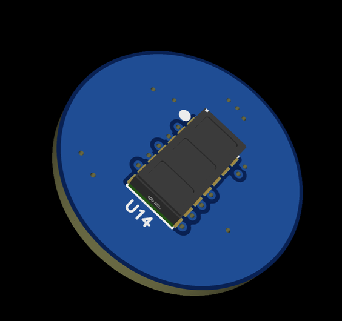
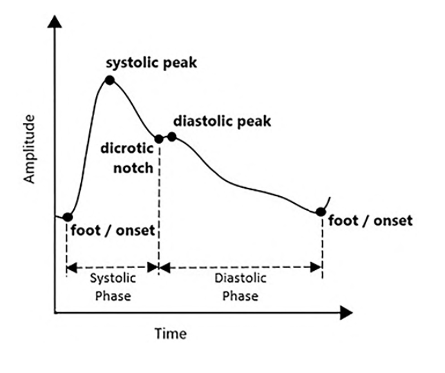
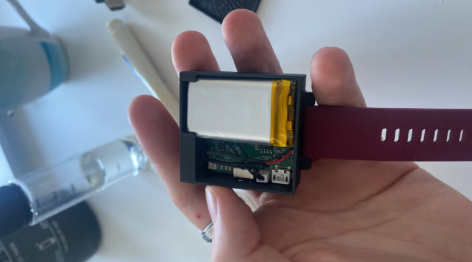

# System Architecture

> High-level design overview of PULSAR medical wearable device

---

## Overview

PULSAR is designed as a **modular medical monitoring system** with two primary operational modes:
- **Cloud-connected mode** (WiFi + AWS upload)
- **Standalone mode** (SD card local storage)

This dual-mode architecture ensures data capture reliability in various hospital environments.

---

## Hardware Architecture Philosophy

### Sensor Integration Strategy

The core design principle revolves around **physiological signal acquisition** using optical sensing technology (PPG - Photoplethysmography).


*Optical sensing principle for cardiovascular monitoring*

### Key Design Decisions

1. **Deported Sensor Design**
   - Circular optical sensor module (Ø10mm)
   - Connected via flexible FPC ribbon cable
   - Improves wearability and contact pressure distribution


*Compact circular sensor module for wrist contact*

2. **Modular PCB Architecture**
   - Main processing board
   - Sensor daughterboard (circular, deported)
   - Power management subsystem
   - Storage interface (microSD)

3. **Dual-Core Processing**
   - Real-time sensor acquisition (dedicated core)
   - Data processing and communication (application core)
   - Ensures zero data loss during intensive operations

---

## Software Architecture

### Data Pipeline

```
Sensor Acquisition → FIFO Buffering → Memory Management → Storage/Transmission
     (100Hz)           (Hardware)         (Firmware)         (WiFi/SD)
```

### Key Components

- **Acquisition Layer**: Multi-channel sensor reading with interrupt-driven FIFO management
- **Buffer Management**: Circular RAM buffers for continuous data flow
- **Storage Layer**: Dual-path architecture (local SD card / cloud upload)
- **Communication Layer**: WiFi connectivity for real-time data streaming

---

## Signal Processing

### Multi-Spectral PPG Analysis

PULSAR captures cardiovascular signals using multiple wavelengths simultaneously:
- **Red LED** (660nm): Surface blood flow
- **Infrared LED** (880nm): Deep tissue perfusion
- **Green LED** (537nm): Motion artifact reference
- **Blue LED** (470nm): Experimental oxygenation metrics


*Typical PPG signal showing cardiac cycle features*

### Signal Quality Metrics

- **Sampling rate**: 100 Hz per channel
- **Resolution**: 19-bit ADC
- **Dynamic range**: Optimized for low-perfusion scenarios
- **Motion artifact rejection**: Accelerometer-based filtering


*Frequency domain analysis showing cardiac band (0.5-2 Hz)*

---

## Power Management

### Energy Budget Strategy

- **Active acquisition**: Optimized for 8-10h continuous operation (R&D prototypes)
- **Future target**: 3-5 days (production platform migration)
- **Power monitoring**: Real-time fuel gauge integration
- **Battery chemistry**: LiPo 3.7V (850mAh prototypes, 550mAh production)

---

## Mechanical Integration

### Wearable Form Factor


*Internal component integration showing compact PCB layout*

### Design Constraints

- **Wrist compatibility**: Standard watch form factor
- **Medical-grade materials**: Biocompatible silicone straps
- **Water resistance**: Protected electronics (splash-resistant)
- **Weight**: Optimized for long-term wear comfort


*Deported sensor architecture improving skin contact*

---

## Development Platforms

### Prototype Phase (ESP32-S3)
- **Advantages**: Rich ecosystem, fast development cycle
- **Limitations**: Power consumption higher than target
- **Use case**: R&D validation, clinical trials

### Production Phase (Nordic nRF5340)
- **Advantages**: Ultra-low power, BLE 5.3, industrial-grade
- **Target**: 8x battery life improvement
- **Use case**: Commercial deployment, regulatory approval

---

## Design Trade-offs

| Aspect | Decision | Rationale |
|--------|----------|-----------|
| **Processing Power** | Dual-core architecture | Real-time acquisition without data loss |
| **Sensor Position** | Deported circular module | Ergonomics + reliable skin contact |
| **Storage Strategy** | Dual-mode (WiFi/SD) | Flexibility for different hospital IT policies |
| **Platform** | ESP32 → Nordic migration | Prototyping speed → Production power efficiency |

---

## Confidentiality Notice

Detailed schematics, firmware source code, and specific component selections remain proprietary to Medivietech. This document provides a high-level architectural overview for portfolio demonstration purposes.

---

**Related Documentation:**
- [Technical Challenges Solved](challenges.md)
- [Clinical Validation Results](validation.md)
- [Hardware Design Guide](../hardware/README.md)
