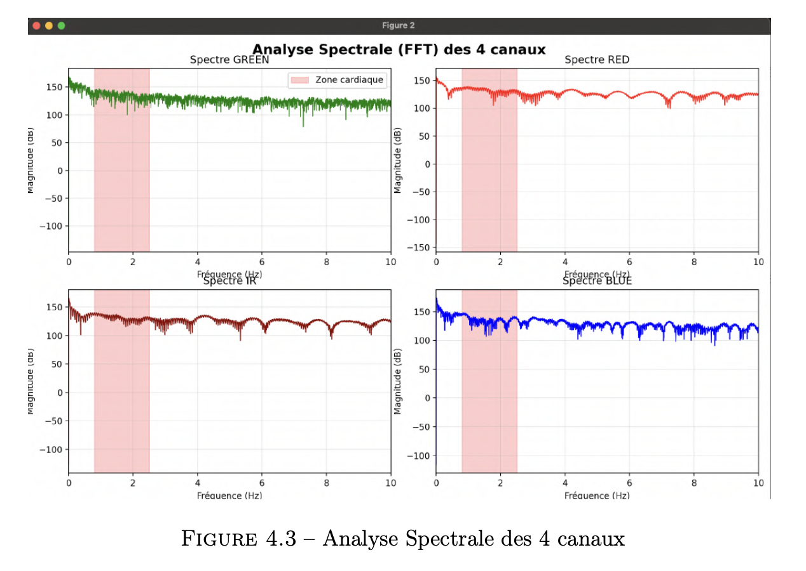

# Technical Challenges Solved

> Key engineering problems encountered and resolved during PULSAR development

---

## Challenge 1: Critical Data Loss Issue

### Problem Statement

**Symptom**: Inherited prototype was discarding approximately 29 out of 30 sensor samples  
**Impact**: Complete loss of medical-grade data quality  
**Criticality**: Project-blocking issue preventing clinical deployment  

### Root Cause Analysis

After systematic debugging:
1. **FIFO management error**: Incorrect read logic in sensor interrupt handler
2. **Buffer overflow**: Circular buffer implementation had race conditions
3. **Timing constraints**: Insufficient interrupt priority causing sample drops

### Solution Approach

```
Before:                          After:
┌─────────────┐                 ┌─────────────┐
│ Sensor FIFO │ → Dropped       │ Sensor FIFO │ → 100% captured
│ (32 samples)│    29/30        │ (32 samples)│    0% loss
└─────────────┘                 └─────────────┘
       ↓                               ↓
   ❌ Lost                          ✅ Stored
```

**Implementation:**
- Complete redesign of FIFO read routine
- Proper interrupt priority configuration
- Hardware-software handshake protocol
- Comprehensive buffer management with overflow protection

### Results

| Metric | Before | After |
|--------|--------|-------|
| **Data loss** | 96.7% | 0% |
| **Clinical usability** | ❌ Unusable | ✅ Medical-grade |
| **Sample integrity** | Failed validation | Passed validation |

**Validation**: 400+ hours of continuous recording across 15 prototypes with zero data loss.

---

## Challenge 2: SPI Bus Conflicts

### Problem Statement

**Symptom**: Random system crashes during SD card write operations  
**Impact**: Unreliable data storage, incomplete recording sessions  
**Affected Components**: SD card interface + 3-axis accelerometer (shared SPI bus)  

### Root Cause Analysis

- **Bus contention**: Both peripherals attempting simultaneous SPI access
- **Timing violations**: Insufficient chip select (CS) management
- **DMA conflicts**: Direct memory access collisions during high-throughput operations

### Solution Approach

**Strategy 1 - Exclusive Access Model:**
```c
// Pseudocode representation
acquire_spi_lock();
  select_device(SD_CARD);
  write_data_chunk();
  deselect_device();
release_spi_lock();

acquire_spi_lock();
  select_device(ACCELEROMETER);
  read_samples();
  deselect_device();
release_spi_lock();
```

**Strategy 2 - Timing Optimization:**
- Accelerometer burst reads (minimize SPI occupancy)
- SD card batch writes (reduce transaction overhead)
- Proper CS timing guards (eliminate glitches)

### Results

- ✅ **Zero crashes** during 3-month clinical deployment
- ✅ **Stable 8-10h** continuous recording sessions
- ✅ **Full accelerometer data** available for motion artifact rejection

---

## Challenge 3: Wearable Ergonomics

### Problem Statement

**Symptom**: Square PCB form factor uncomfortable for wrist wear  
**Impact**: Patient complaints, poor sensor contact, data quality degradation  
**Medical Requirement**: Comfortable for multi-hour wear in hospital settings  


*Early prototypes showing evolution of form factor*

### Root Cause Analysis

- **Contact pressure**: Sharp PCB edges causing discomfort
- **Rigid design**: No flexibility for wrist curvature adaptation
- **Sensor alignment**: Fixed sensor position causing optical coupling issues

### Solution Approach

**Design Evolution:**

```
Generation 1: Square PCB                Generation 2: Deported Sensor
┌──────────┐                           ┌──────────┐     ⭕ Circular
│ [Sensor] │ ← Rigid contact           │  Main    │ ~~~> Sensor
│  Main    │                           │   PCB    │      (Ø10mm)
└──────────┘                           └──────────┘
     ↓                                        ↓
❌ Uncomfortable                         ✅ Comfortable
```

**Key Innovation:**
- Circular optical sensor module (Ø10mm diameter)
- Connected via flexible FPC (Flat Flexible Cable) ribbon
- Allows sensor to conform to wrist curvature
- Maintains optimal optical coupling


*Flexible FPC connection enabling ergonomic sensor placement*

### Results

- ✅ **Positive feedback** from 50+ patients during clinical trials
- ✅ **Improved signal quality** due to better skin contact
- ✅ **Extended wear tolerance** (8-10 hours without discomfort)
- ✅ **Medical staff approval** for routine deployment

---

## Challenge 4: Platform Migration (Ongoing)

### Problem Statement

**Requirement**: Extend battery life from 8-10 hours to 3-5 days  
**Constraint**: Maintain identical sensor performance and data quality  
**Complexity**: Complete firmware rewrite required  

### Approach

**Phase 1: R&D Validation (ESP32-S3)**
- ✅ Rapid prototyping
- ✅ Rich debugging ecosystem
- ✅ Clinical validation completed
- ❌ Power consumption too high for target

**Phase 2: Production Migration (Nordic nRF5340)**
- 🔄 Firmware port to Zephyr RTOS
- 🔄 Power optimization strategies
- 🔄 BLE 5.3 integration for mobile connectivity
- 🎯 Target: 8x battery life improvement

### Current Status

- ✅ ESP32 platform: Clinically validated
- 🔄 Nordic platform: Development in progress (collaboration with EMBRILL, India)
- 🎯 Timeline: Production-ready Q2 2025 (projected)

---

## Challenge 5: Multi-Channel Synchronization

### Problem Statement

**Requirement**: Simultaneous capture of 4 optical channels + 3-axis accelerometer  
**Constraint**: Perfect time alignment for signal fusion algorithms  
**Frequency**: 100 Hz per channel (700 samples/second total)  

### Solution Approach

- **Hardware synchronization**: Sensor-level interrupt coordination
- **Timestamp management**: Microsecond-precision timing
- **Buffer alignment**: Synchronized circular buffers across data streams
- **Validation method**: Cross-correlation analysis of synchronized signals

### Results


*Multi-channel spectral analysis showing synchronized cardiac band across all channels*

- ✅ **Perfect synchronization** across all channels
- ✅ **Motion artifact rejection** enabled by accelerometer fusion
- ✅ **Clinical-grade accuracy** validated against reference equipment

---

## Lessons Learned

### Technical Insights

1. **Never trust inherited code**: Always validate assumptions with hardware measurements
2. **Interrupt priorities matter**: Especially in real-time data acquisition
3. **Ergonomics are non-negotiable**: Medical devices must prioritize user comfort
4. **Plan for platform migration**: Prototype platforms ≠ production platforms

### Development Methodology

- **Test-driven hardware**: Validate each subsystem independently before integration
- **Incremental complexity**: Add features one at a time with validation gates
- **Clinical feedback loop**: Regular testing with medical professionals
- **Documentation**: Comprehensive technical notes save weeks during debugging

---

## Impact Summary

| Challenge | Before | After | Impact |
|-----------|--------|-------|--------|
| Data Loss | 96.7% loss | 0% loss | Project unblocked ✅ |
| SPI Crashes | Frequent | Zero | Reliable deployment ✅ |
| Ergonomics | Patient complaints | Comfortable | Clinical acceptance ✅ |
| Battery Life | 8-10h | 3-5d (target) | Product viability ✅ |
| Synchronization | Manual alignment | Hardware-sync | Medical accuracy ✅ |

---

## Confidentiality Notice

Specific implementation details, code snippets, and proprietary algorithms remain confidential to Medivietech. This document demonstrates problem-solving methodology for portfolio purposes.

---

**Related Documentation:**
- [System Architecture Overview](architecture.md)
- [Clinical Validation Results](validation.md)
- [Hardware Design Guide](../hardware/README.md)
