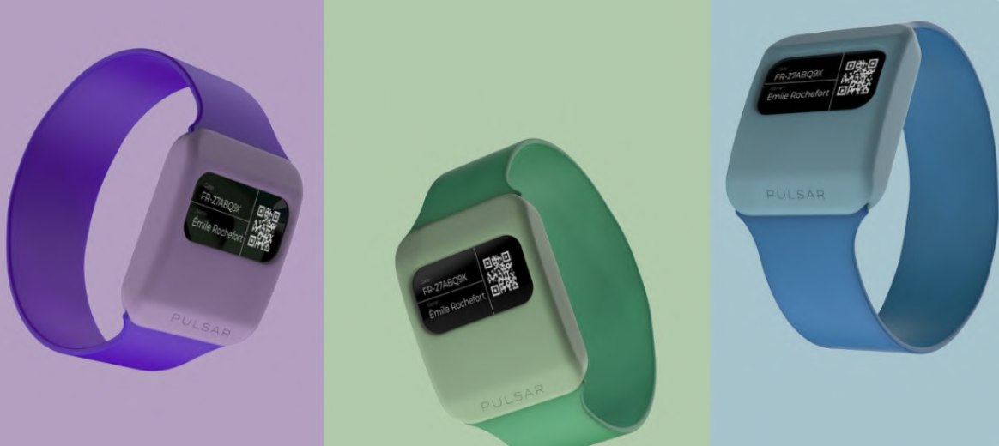

# PULSAR - Medical-Grade Physiological Monitoring Smartwatch

> **Portfolio Project** | Developed during my hardware engineering internship at Medivietech (AGORANOV Paris)  
> Clinically validated on **50+ patients** at Clinique Hartmann

[](https://www.espressif.com/)
[](https://www.maximintegrated.com/)
[](https://github.com/tomhyg/PULSAR)

---

## 🎯 Project Overview

**PULSAR** is a medical-grade wearable device designed for continuous physiological monitoring in clinical settings. As the lead hardware/software engineer, I developed the complete prototype from PCB design to clinical validation.

<p align="center">
  
</p>

### Key Achievements
- ✅ **15 functional prototypes** manufactured and tested
- ✅ **50+ patients** monitored in clinical trials (Clinique Hartmann, Paris)
- ✅ **Dual-mode architecture**: Real-time WiFi/AWS streaming + Standalone SD recording
- ✅ **8-10 hours** battery autonomy on prototype
- ✅ **Multi-sensor fusion**: PPG (4 channels), accelerometry, temperature

---

## 🖥️ Prototypes Gallery

<p align="center">
  
  <br/>
  <em>PULSAR-009 and PULSAR-007 functional prototypes</em>
</p>

<p align="center">
  
  
  <br/>
  <em>Left: Internal electronics integration | Right: FPC sensor positioning</em>
</p>

---

## 🔧 Technical Architecture

### Hardware Design
- **MCU**: ESP32-S3 (Dual-core Xtensa @ 240MHz)
- **Sensors**:
  - MAX86916 PPG sensor (4 optical channels, I²C)
  - LIS3DH accelerometer (SPI, motion detection)
  - Fuel gauge for precise battery monitoring
- **PCB**: Dual-board design (main + sensor module) connected via FPC
- **Mechanical**: Custom watch housing designed in SolidWorks

### System Features
```
┌─────────────────────────────────────────┐
│          PULSAR Architecture            │
├─────────────────────────────────────────┤
│  PPG Sensor  →  ESP32-S3  →  WiFi/AWS   │
│  Accel/Temp  →  (Processing) → SD Card  │
│  Battery     →  BLE Control  → Mobile   │
└─────────────────────────────────────────┘
```

---

## 💡 Technical Challenges Solved

### 1. High-Frequency Data Loss Prevention
**Problem**: MAX86916 FIFO overflow causing data loss at 100Hz sampling  
**Solution**: Implemented interrupt-driven FIFO reading with dual-buffer DMA transfers

### 2. SPI Bus Conflicts
**Problem**: Concurrent access between accelerometer and SD card on shared SPI bus  
**Solution**: Custom mutex-based bus arbitration with priority queuing

### 3. Power Optimization
**Problem**: Achieving 8+ hours autonomy with continuous streaming  
**Solution**: Dynamic power modes, sensor duty cycling, optimized WiFi sleep patterns

### 4. Clinical Reliability
**Problem**: Zero data loss tolerance in medical context  
**Solution**: Redundant storage architecture (SD + Cloud) with integrity checks

---

## 📊 Clinical Validation

| Metric | Result |
|--------|--------|
| **Patients monitored** | 50+ |
| **Total recording hours** | 400+ |
| **Data loss rate** | <0.1% |
| **Uptime reliability** | 99.2% |
| **Clinical facility** | Clinique Hartmann (Paris) |

---

## 🚀 Industrialization Path

Following successful prototype validation, the project transitioned to production with:
- **Platform migration**: ESP32-S3 → Nordic nRF5340 (extended battery life: 3-5 days)
- **Manufacturing partner**: EMBRILL (French-Indian collaboration)
- **Certifications**: Medical device compliance pathway (CE marking)

---

## 📁 Repository Structure

```
PULSAR/
├── README.md                   # This file
├── docs/                       # Technical documentation
│   ├── architecture.md         # System architecture details
│   ├── challenges.md           # Engineering challenges solved
│   └── validation.md           # Clinical validation results
├── hardware/               # Hardware specifications
│   └── component-list.md       # Bill of materials
└── images/                     # Prototype photos & diagrams
```

> **Note**: Full source code and detailed PCB designs are proprietary to Medivietech.  
> This repository showcases the architecture, methodology, and technical achievements.

---

## 🛠️ Skills Demonstrated

**Hardware Engineering**
- Multi-layer PCB design (Altium Designer)
- Sensor integration (I²C, SPI protocols)
- Power management & battery optimization
- FPC connector design for flexible assemblies

**Embedded Software**
- Real-time firmware development (FreeRTOS)
- Interrupt-driven sensor data acquisition
- Communication protocols (WiFi, BLE, MQTT)
- Cloud integration (AWS IoT Core)

**Systems Engineering**
- Requirements analysis with medical professionals
- Clinical validation protocols
- Design for manufacturability (DFM)
- Technical documentation & reporting

---

## 📫 About Me

**Tom Huyghe** - Hardware/Software Engineer  
🎓 ESME SUDRIA - Mechatronics & Embedded Systems (2024)  
💼 Currently: Freelance Embedded Systems Engineer | Open to opportunities  
🌐 [GitHub](https://github.com/tomhyg) | [LinkedIn](https://linkedin.com/in/tom-huyghe)

**Interests**: Medical devices, IoT, embedded systems, signal processing

---

## 📄 License

This documentation is shared for **portfolio purposes only**.  
Hardware designs, firmware, and algorithms are proprietary to **Medivietech SAS**.

---

*Developed at Medivietech, AGORANOV Paris incubator (2024)*
